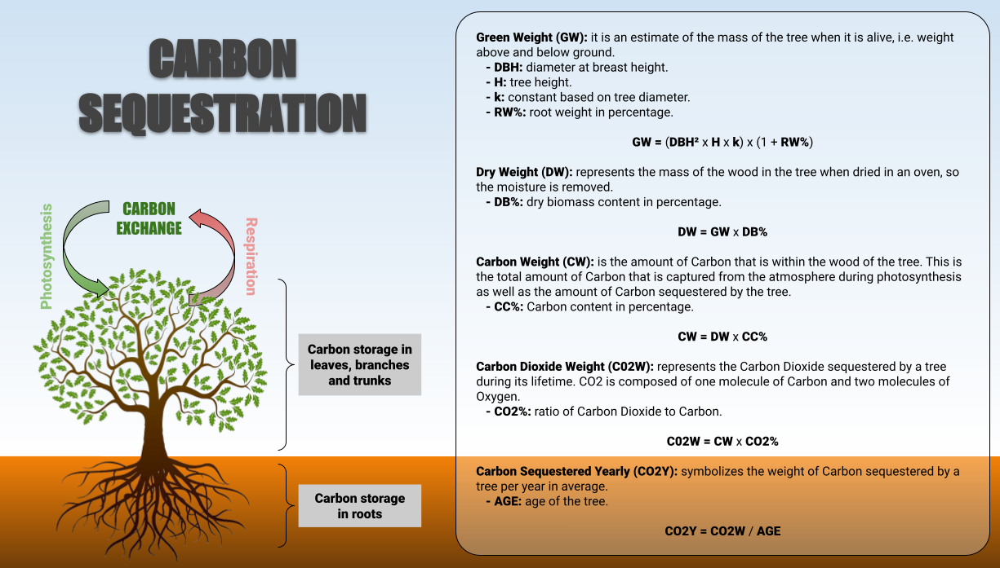

# Ecoverse APIs

## Table of Contents

- Introduction
- Requirements
- Installation
- Local Usage
- API Specification
- Directory Structure

## Introduction

The Ecoverse API module manages the web HTTP requests/responses from the Ecoverse application. The APIs mainly calculate the carbon dioxide (CO2) sequestered by different plantations (farms) around the world using the data from multiple partners, such as [CMO Supply Chain Integrity](https://cmogroup.io/).

CMO runs Forest Stewardship Council® (FSC®) forest management and chain of custody group schemes worldwide. CMO quality data are essential for the accurate calculation of CO2 sequestered by each tree planted on these farms.

The rate of carbon sequestration depends on the growth characteristics of the tree species, the conditions for growth where the tree is planted, and the density of the tree's wood. The process of estimating the amount of CO2 sequestered from a given tree follows these steps:

1. Determine the total (green) weight of the tree.
2. Determine the dry weight of the tree.
3. Determine the weight of carbon atoms in the tree.
4. Determine the weight of CO2 sequestered by the tree over its lifetime.
5. Determine the weight of CO2 sequestered by the tree per year.

The following is an illustrative image of the process, and a descriptive model can be found [here](./docs/pdf/carbon_sequestration_model.pdf).

[](./docs/png/carbon_sequestration_model.png)

## Requirements

Creating environment variables.

```bash
# APPLICATION
ENVIRONMENT = [str] # One of the following: development | production

# ADMIN
ADMIN_USERNAME = [str]
ADMIN_PASSWORD = [str]

# DATABASE
DATABASE_URL = [str] # PostgreSQL database

# SECURITY
JWT_EXPIRE_MINUTES = [int] # It is recommended to be shorter than 30 minutes
JWT_ALGORITHM = [str] # One of the following: HS256 | RS256 | HS512 | RS512
JWT_SECRET_KEY = [str] # To generate a secure random secret key use the command: openssl rand -hex <256 or 512 depending on algo used>

# MAPBOX
MAPBOX_ACCESS_TOKEN = [str]
```

## Installation

Installing dependencies.

```python
pip install --upgrade pip setuptools -r requirements.txt
pre-commit install
```

## Local Usage

Running the application.

```python
uvicorn main:app --reload
```

## API Specification

[Documentation](http://127.0.0.1:8000/redoc) and [test environment](http://127.0.0.1:8000/docs) are available while running locally. **Make sure to not be in the production environment.**

## Directory Structure

```bash
.
├── .github/workflows
│   └── on_push.yaml                # GitHub actions executed whenever a push is made (quality and test checks)
├── .vscode
│   └── settings.json               # VS Code setting preferences
├── apis
│   ├── routers/**.py               # [directory] multiple API routers
│   ├── schemas/**.py               # [directory] multiple API schemas (http request/response formats)
│   └── middleware.py               # API routers aggregator
├── database
│   ├── crud.py                     # Create, Read, Update, Delete (CRUD) operations to manage data elements of relational databases
│   ├── models.py                   # database tables
│   ├── session.py                  # database connection setup
│   └── startup.py                  # database initial data insertion.
├── docs
│   ├── json/**.py                  # [directory] multiple JSON files
│   ├── pdf/**.py                   # [directory] multiple PDF files
│   └── png/**.py                   # [directory] multiple PNG files
├── helpers
│   ├── api_exceptions.py           # API exceptions settings
│   ├── api_routers.py              # include API routers
│   ├── api_throttling.py           # API throttling settings
│   ├── http_requests.py            # HTTP requests settings and error handling
│   ├── lru_caching.py              # LRU cache decorator settings
│   └── misc.py                     # miscellaneous collection of unit functions
├── models
│   ├── carbon_sequestration.py     # carbon sequestration algo
│   ├── farm_data_transformation.py # farm data transformation on ETL process
│   ├── farm_proof_of_service.py    # farm proof of service, such as real-time satellite photo
│   └── plantation_metrics.py       # platation metrics based on a given tree
├── security
│   ├── admin.py                    # admin authentication setup
│   ├── dependencies.py             # required inejctions (security and authentication) to happen before running an API router
│   ├── hashing.py                  # encrypting and verifying signatures
│   └── tokens.py                   # JWT access tokens
├── .env                            # project environment variables
├── .flake8                         # Flake8 settings and coding standards on a module-by-module basis
├── .gitignore                      # files/directories to be ignored by GitHub when commiting code
├── .pre-commit-config.yaml         # pre-commit hooks settings
├── .pylintrc                       # Pylint settings and coding standards on a module-by-module basis
├── config.py                       # project settings
├── config.yaml                     # project settings
├── main.py                         # Ecoverse DB application
├── Procfile                        # [deployment] Heroku commands that are executed by the dyno's app on startup
├── README.md                       # this project guide
└── requirements.txt                # required Python libraries, modules, and packages to run and deploy the project
```
